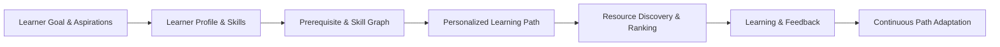

# Initial Project Analysis & Understanding Response

**Author:** Assistant  
**Context:** Overview of architecture, components, and project mission.

---

I have analyzed the repository, documentation, architecture specifications, and current branch state. Here is a comprehensive overview demonstrating my understanding of the **Hades AI-Assisted Skill Development Platform**.

---

### 1. Project Purpose & Core Value Proposition
**Hades** is an **AI-powered personalized learning and skill development platform** (built for the HCLTech Hackathon). 
Unlike static course recommendation engines, Hades dynamically models a learner's holistic profile to generate, evaluate, and continuously adapt learning paths:



---

### 2. Full-Stack System Architecture & Boundaries

```
[ Next.js / React Frontend ] (Learner Experience Layer)
              │
              ▼  (HTTP / WebSocket)
    [ Scala Backend Service ] (State, Auth, Business Rules, DB, Event Persistence)
              │
              ▼  (Backend-to-Backend HTTP Contract)
[ Python / FastAPI + Agno AI Service ] (Autonomous Reasoning, LLMs, Skill Graphs)
              │
        ┌─────┴─────────────────┐
 [ Mistral AI LLM ]      [ Knowledge & Vector Tools ]
```

* **Frontend (React / Next.js)**: Learner UI. Does **not** communicate directly with the AI service or store AI provider keys.
* **Core Application Backend (Scala)**: System of record. Owns persistence (PostgreSQL + pgvector, Redis), business logic, authentication, and authoritative validation of progress/milestone unlocks.
* **AI Service (Python / FastAPI + Agno)**: Dedicated reasoning engine powered by LLMs (configured with Mistral AI) that generates structured, validated learning paths, assessments, and adaptation recommendations.

---

### 3. Current State & Milestone 1 Focus

According to `project_overview.md` and `orchestrator.md`:

1. **Unblocking Parallel Development**:
   * The Scala ↔ Python contract is not yet finalized.
   * Milestone 1 explicitly uses **mock contracts and mock tool interfaces** so the AI service and Scala backend can develop in parallel.
2. **First Endpoint in Scope**:
   * `POST /ai/generate-learning-path`
   * Accepts: `GenerateLearningPathRequest` (learner ID, target goal, current skill levels, weekly time availability, learning preferences, etc.).
   * Returns: `LearningPathResponse` (milestones, modules, estimated hours/weeks, prerequisite chains, skill gap analysis, adaptation rationale).
3. **Current Build Flow**:
   * Define Pydantic schemas (`app/schemas/`).
   * Implement mock tool functions (`app/tools/mock_tools.py`).
   * Build the Agno Reasoning Agent using Mistral AI (`app/agents/learning_path_agent.py`).
   * Wrap with the `AIOrchestrator` (`app/orchestrator/orchestrator.py`).
   * Expose via FastAPI routes (`app/main.py` & `app/api/routes.py`).
   * Validate with unit and integration tests (`tests/`).

---

### 4. Future Capabilities (Post-Milestone 1)
* **Resource Discovery & Ranking**: Discovering tutorials, articles, videos, and documentation tailored to learning style.
* **Path Adaptation Engine**: Adjusting modules based on learner speed, quiz scores, or changing goals.
* **Interactive AI Mentor / Chat**: In-context learner guidance.
* **Assessment Generation**: Dynamic evaluation of competencies.
