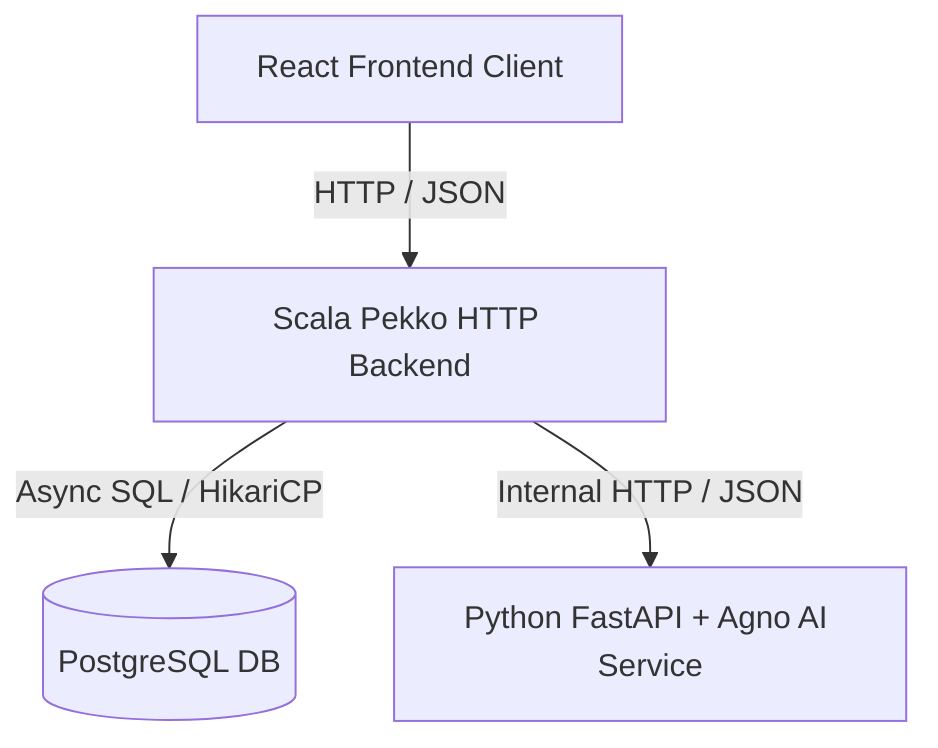
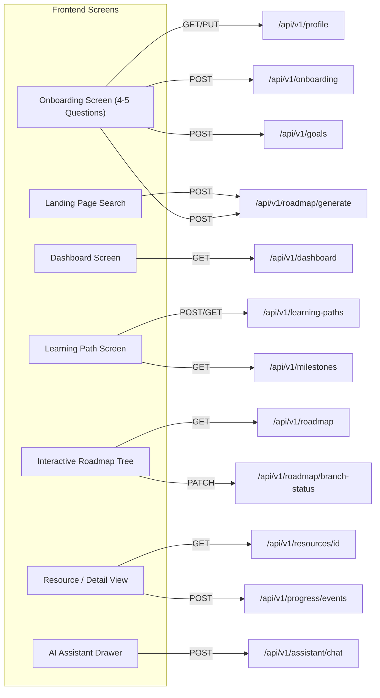

# HADES Platform — Complete Frontend API Specification & Integration Reference

**Backend Base URL (Local Development)**: `http://localhost:8000/api/v1`  
**API Protocol**: HTTP / JSON  
**Backend Framework**: Scala 2.13, Apache Pekko HTTP, Spray JSON  

---

## Architecture & Communication Flow



### Critical Architectural Boundaries:
1. **Frontend Interface**: The React frontend communicates **ONLY** with the Scala backend.
2. **AI Isolation**: The React frontend **MUST NOT** directly call the Python AI service (`http://localhost:8001`).
3. **Internal AI Endpoints**: Internal endpoints under `/internal/ai/*` (such as `/internal/ai/generate-learning-path` and `/internal/ai/chat`) are **internal-only** service-to-service endpoints consumed exclusively by the Scala backend.

---

## Authentication Reference

The HADES backend uses an isolated authentication abstraction. Identity is extracted from incoming HTTP headers and resolved to an authoritative application `User` entity.

### Headers Supported

- `Authorization: Bearer <token-or-user-id>`
- `X-User-Id: <user-id>`

### Authentication Modes

- **DEVELOPMENT AUTH (Current Active Implementation)**:
  - If no header is provided, the backend automatically defaults to user ID `"dev-user-1"` (`email: dev@hades.ai`, `name: Default Learner`).
  - If a token or user ID is passed in `Authorization: Bearer <ID>` or `X-User-Id: <ID>`, the backend resolves or automatically registers that user in PostgreSQL.
- **PRODUCTION AUTH (Architecture Ready)**:
  - The `AuthClient` interface isolates auth verification. When Clerk or OAuth JWT validation is enabled, token verification occurs inside `AuthClient` without changing any controller signatures or endpoint contracts.

---

## Standardized Error Response Format

All API errors return a consistent JSON payload structure:

```json
{
  "error": {
    "code": "ERROR_CODE",
    "message": "Human readable error description."
  }
}
```

### HTTP Status Codes Returned by Backend

- `200 OK`: Request succeeded.
- `400 Bad Request`: Invalid JSON syntax, payload validation failure, or domain constraint error (`code`: `"INVALID_JSON"`, `"VALIDATION_ERROR"`, `"PROFILE_ERROR"`, `"GOAL_ERROR"`, etc.).
- `401 Unauthorized`: Missing or invalid authentication token (`code`: `"UNAUTHORIZED"`).
- `404 Not Found`: Resource, skill, or active goal does not exist (`code`: `"NOT_FOUND"`).
- `500 Internal Server Error`: Unexpected internal backend exception (`code`: `"INTERNAL_SERVER_ERROR"`).
- `502 Bad Gateway`: Python AI service returned a non-2xx status code (`code`: `"AI_SERVICE_ERROR"`).
- `503 Service Unavailable`: Python AI service is unreachable or timed out (`code`: `"AI_SERVICE_UNAVAILABLE"`).

---

## API Specification by Category

---

### 1. System

#### `GET /health`

- **Purpose**: Server liveness and health check.
- **Frontend Screen/Component**: App startup health monitor / status bar.
- **Authentication**: None.
- **Headers**: None.
- **Path / Query Parameters**: None.
- **Request Body**: None.
- **Successful Status**: `200 OK`
- **Example Response**:
  ```json
  {
    "status": "ok"
  }
  ```
- **cURL**:
  ```bash
  curl -X GET http://localhost:8000/health
  ```

---

### 2. Profile

#### `GET /api/v1/profile`

- **Purpose**: Retrieves the authenticated learner's profile details.
- **Frontend Screen/Component**: Settings Screen, Profile Dashboard Header.
- **Authentication**: Required (defaults to `dev-user-1` in dev mode).
- **Headers**: `Authorization: Bearer <token>` or `X-User-Id: <user-id>`
- **Request Body**: None.
- **Successful Status**: `200 OK`
- **Example Response**:
  ```json
  {
    "user_id": "dev-user-1",
    "experience_level": "beginner",
    "minutes_per_day": 60,
    "days_per_week": 5,
    "target_role": "Machine Learning Engineer",
    "learning_preferences": [
      "hands_on",
      "video"
    ]
  }
  ```
- **cURL**:
  ```bash
  curl -X GET http://localhost:8000/api/v1/profile \
    -H "Authorization: Bearer dev-user-1"
  ```

#### `PUT /api/v1/profile`

- **Purpose**: Updates the learner's preferences, daily time availability, or target career role.
- **Frontend Screen/Component**: Profile Edit Screen, Time Commitment Settings.
- **Authentication**: Required.
- **Headers**:
  - `Content-Type: application/json`
  - `Authorization: Bearer <token>` or `X-User-Id: <user-id>`
- **Request Body**:
  ```json
  {
    "experience_level": "intermediate",
    "minutes_per_day": 45,
    "days_per_week": 4,
    "target_role": "Data Scientist",
    "learning_preferences": ["hands_on", "project_based"]
  }
  ```
- **Field Specs**:
  - `experience_level` (*optional string*): `"beginner"`, `"intermediate"`, or `"advanced"`.
  - `minutes_per_day` (*optional integer*): Must be > 0.
  - `days_per_week` (*optional integer*): Must be > 0.
  - `target_role` (*optional string*): Target career role.
  - `learning_preferences` (*optional array of strings*): e.g. `["hands_on", "video", "project_based"]`.
- **Successful Status**: `200 OK`
- **Example Response**: Returns updated `ProfileResponse` (same structure as `GET /api/v1/profile`).
- **cURL**:
  ```bash
  curl -X PUT http://localhost:8000/api/v1/profile \
    -H "Content-Type: application/json" \
    -H "Authorization: Bearer dev-user-1" \
    -d '{
      "experience_level": "intermediate",
      "minutes_per_day": 45,
      "days_per_week": 4,
      "target_role": "Data Scientist",
      "learning_preferences": ["hands_on", "project_based"]
    }'
  ```

---

### 3. Onboarding (4-5 Goal Setup Questions)

#### `POST /api/v1/onboarding`

- **Purpose**: Completes initial learner onboarding in a single transaction (saves profile preferences, interests, and creates the primary learning goal).
- **Frontend Screen/Component**: Onboarding Wizard (Welcome Setup Screen - 4-5 questions).
- **Authentication**: Required.
- **Headers**:
  - `Content-Type: application/json`
  - `Authorization: Bearer <token>`
- **Request Body**:
  ```json
  {
    "experience_level": "beginner",
    "minutes_per_day": 60,
    "days_per_week": 5,
    "target_role": "Machine Learning Engineer",
    "interests": [
      "Artificial Intelligence",
      "Python",
      "Mathematics"
    ],
    "learning_preferences": [
      "hands_on",
      "video"
    ],
    "goal_title": "Learn Machine Learning Fundamentals",
    "goal_description": "Build foundational ML skills for industry projects"
  }
  ```
- **Validation Rules**:
  - `experience_level`: Cannot be empty.
  - `minutes_per_day`: Must be > 0.
  - `days_per_week`: Must be > 0.
  - `goal_title` & `goal_description`: Cannot be empty.
- **Successful Status**: `200 OK`
- **Example Response**: Returns `ProfileResponse`.
- **cURL**:
  ```bash
  curl -X POST http://localhost:8000/api/v1/onboarding \
    -H "Content-Type: application/json" \
    -H "Authorization: Bearer dev-user-1" \
    -d '{
      "experience_level": "beginner",
      "minutes_per_day": 60,
      "days_per_week": 5,
      "target_role": "Machine Learning Engineer",
      "interests": ["Artificial Intelligence", "Python"],
      "learning_preferences": ["hands_on", "video"],
      "goal_title": "Learn ML Fundamentals",
      "goal_description": "Build foundational ML skills"
    }'
  ```

---

### 4. Goals

#### `POST /api/v1/goals`

- **Purpose**: Creates a new active learning goal (and updates active target career goal if `target_role` is provided).
- **Frontend Screen/Component**: Goal Creation Modal / Screen.
- **Authentication**: Required.
- **Headers**: `Content-Type: application/json`, `Authorization: Bearer <token>`
- **Request Body**:
  ```json
  {
    "title": "Learn Machine Learning Fundamentals",
    "description": "Build foundational ML skills",
    "target_role": "Machine Learning Engineer"
  }
  ```
- **Field Specs**: `title` (required string), `description` (required string), `target_role` (optional string).
- **Successful Status**: `200 OK`
- **Example Response**:
  ```json
  {
    "id": "c71a39d8-79d1-4a2e-b6a8-2041dbd4e98f",
    "title": "Learn Machine Learning Fundamentals",
    "description": "Build foundational ML skills",
    "is_active": true
  }
  ```
- **cURL**:
  ```bash
  curl -X POST http://localhost:8000/api/v1/goals \
    -H "Content-Type: application/json" \
    -H "Authorization: Bearer dev-user-1" \
    -d '{
      "title": "Learn Machine Learning Fundamentals",
      "description": "Build foundational ML skills",
      "target_role": "Machine Learning Engineer"
    }'
  ```

#### `GET /api/v1/goals`

- **Purpose**: Retrieves the learner's currently active learning goal.
- **Frontend Screen/Component**: Active Goal Widget on Dashboard.
- **Authentication**: Required.
- **Successful Status**: `200 OK` (returns `GoalResponse`).
- **Error Status**: `404 Not Found` if no goal exists.
- **cURL**:
  ```bash
  curl -X GET http://localhost:8000/api/v1/goals \
    -H "Authorization: Bearer dev-user-1"
  ```

---

### 5. Learning Paths

> [!IMPORTANT]
> **Learning Path Flow**:
> The React frontend does **NOT** need to build the internal AI context payload when requesting a learning path for the authenticated user.
> When `POST /api/v1/learning-paths` is called with an empty body `{}` (or empty payload) alongside the authentication header, Scala automatically loads the profile, goal, existing skills, and time availability from PostgreSQL, calls the Python AI service, validates the structure, and transactionally persists the learning path in PostgreSQL.

#### `POST /api/v1/learning-paths`

- **Purpose**: Generates and persists a personalized learning roadmap.
- **Frontend Screen/Component**: "Generate Roadmap" Button on Roadmap Screen.
- **Authentication**: Required.
- **Headers**: `Content-Type: application/json`, `Authorization: Bearer <token>`
- **Request Body (Recommended for Frontend)**:
  ```json
  {}
  ```
- **Successful Status**: `200 OK`
- **Example Response**:
  ```json
  {
    "title": "Machine Learning Fundamentals",
    "description": "A personalized learning roadmap to ML Engineering.",
    "estimated_hours": 180,
    "skills": [
      {
        "id": "python",
        "name": "Python",
        "difficulty": "beginner"
      }
    ],
    "nodes": [
      {
        "id": "python-foundations",
        "title": "Python Foundations",
        "description": "Master syntax, functions, and OOP.",
        "skill_ids": ["python"],
        "prerequisite_ids": [],
        "estimated_hours": 20,
        "sequence": 1
      }
    ],
    "milestones": [
      {
        "id": "m1",
        "title": "Foundations Complete",
        "node_ids": ["python-foundations"]
      }
    ]
  }
  ```
- **cURL**:
  ```bash
  curl -X POST http://localhost:8000/api/v1/learning-paths \
    -H "Content-Type: application/json" \
    -H "Authorization: Bearer dev-user-1" \
    -d '{}'
  ```

#### `GET /api/v1/learning-paths`

- **Purpose**: Fetches the user's active learning roadmap.
- **Frontend Screen/Component**: Learning Path / Roadmap View Screen.
- **Authentication**: Required.
- **Successful Status**: `200 OK` (returns `LearningPathResponse`).
- **cURL**:
  ```bash
  curl -X GET http://localhost:8000/api/v1/learning-paths \
    -H "Authorization: Bearer dev-user-1"
  ```

#### `GET /api/v1/learning-paths/{id}`

- **Purpose**: Fetches a specific learning roadmap by its UUID `id`.
- **Frontend Screen/Component**: Historical Path Viewer / Shared Roadmap View.
- **Authentication**: Required / Optional.
- **Path Parameter**: `id` (*string*): UUID of the learning path.
- **Successful Status**: `200 OK`
- **Error Status**: `404 Not Found` if path ID does not exist.
- **cURL**:
  ```bash
  curl -X GET http://localhost:8000/api/v1/learning-paths/path-uuid-123
  ```

---

### 5.1 Interactive Roadmap Tree (Roadmap.sh-style)

> [!IMPORTANT]
> **This is the core visual feature of the HADES platform.**
> The frontend renders an interactive tree UI (similar to roadmap.sh) where each **main node** (spine) has expandable **branches** (subtopics). Users click on branches to mark them as `done`, `learning`, `skip`, or `pending`. Each branch also contains **AI-ranked YouTube videos**, **articles**, and optional **paid courses**.

#### `POST /api/v1/roadmap/generate`

- **Purpose**: Generates a personalized interactive roadmap tree from a search query or role. This is called from the **Landing Page search bar** (instant search) and from the **Onboarding Wizard** (full context). This is the primary AI generation endpoint.
- **Frontend Screen/Component**: Landing Page Hero Search Bar, Onboarding Wizard Final Step.
- **Authentication**: Required.
- **Headers**: `Content-Type: application/json`, `Authorization: Bearer <token>`
- **Request Body**:
  ```json
  {
    "query": "Autonomous AI Agent Engineer",
    "experience_level": "Intermediate",
    "interests": ["Generative AI", "Agentic Workflows"],
    "weekly_hours": 14,
    "timeframe_weeks": 12
  }
  ```
- **Successful Status**: `200 OK`
- **Side Effect**: Sets `has_generated_roadmap = true` on the user record (used for redirect logic on next login).
- **cURL**:
  ```bash
  curl -X POST http://localhost:8000/api/v1/roadmap/generate \
    -H "Content-Type: application/json" \
    -H "Authorization: Bearer dev-user-1" \
    -d '{
      "query": "Autonomous AI Agent Engineer"
    }'
  ```

#### `GET /api/v1/roadmap`

- **Purpose**: Fetches the user's current active interactive roadmap tree with persisted branch statuses.
- **Frontend Screen/Component**: Interactive Roadmap Tree View (Learning Path Page, Roadmap tab).
- **Authentication**: Required.
- **Headers**: `Authorization: Bearer <token>`
- **Successful Status**: `200 OK`
- **Error Status**: `404 Not Found` if no roadmap has been generated yet.
- **cURL**:
  ```bash
  curl -X GET http://localhost:8000/api/v1/roadmap \
    -H "Authorization: Bearer dev-user-1"
  ```

#### `PATCH /api/v1/roadmap/branch-status`

- **Purpose**: Updates the status of a specific branch node in the roadmap tree. This is the **core interaction** — users click branches to mark progress.
- **Frontend Screen/Component**: `RoadmapCanvas.jsx` — branch hover action buttons ("Mark Learning", "Mark Done", "Skip").
- **Authentication**: Required.
- **Headers**: `Content-Type: application/json`, `Authorization: Bearer <token>`
- **Request Body**:
  ```json
  {
    "main_node_id": "node_vector_storage",
    "branch_id": "sub_pgvector_hnsw",
    "status": "done"
  }
  ```
- **Allowed `status` values**: `"pending"` | `"learning"` | `"done"` | `"skip"`
- **Successful Status**: `200 OK`
- **Example Response**:
  ```json
  {
    "success": true,
    "main_node_id": "node_vector_storage",
    "branch_id": "sub_pgvector_hnsw",
    "new_status": "done",
    "main_node_status": "learning",
    "roadmap_progress_percentage": 42
  }
  ```

---

### 6. Skills

#### `GET /api/v1/skills`

- **Purpose**: Lists all global skills registered in the platform catalog.
- **Frontend Screen/Component**: Skill Catalog / Skill Selector.
- **Authentication**: Optional.
- **Successful Status**: `200 OK`
- **cURL**:
  ```bash
  curl -X GET http://localhost:8000/api/v1/skills
  ```

#### `GET /api/v1/skills/{id}`

- **Purpose**: Fetches details for a specific skill by ID.
- **Frontend Screen/Component**: Skill Detail Modal.
- **Path Parameter**: `id` (*string*): e.g. `"python"`.
- **Successful Status**: `200 OK`
- **cURL**:
  ```bash
  curl -X GET http://localhost:8000/api/v1/skills/python
  ```

#### `GET /api/v1/skills/{id}/progress`

- **Purpose**: Fetches the authenticated user's progress percent and confidence score for a skill.
- **Frontend Screen/Component**: Skill Progress Gauge / Mastery Indicator.
- **Authentication**: Required.
- **Headers**: `Authorization: Bearer <token>`
- **Path Parameter**: `id` (*string*): Skill ID.
- **Successful Status**: `200 OK`
- **cURL**:
  ```bash
  curl -X GET http://localhost:8000/api/v1/skills/python/progress \
    -H "Authorization: Bearer dev-user-1"
  ```

---

### 7. Resources

#### `GET /api/v1/resources`

- **Purpose**: Lists available learning resources (courses, videos, documentation).
- **Frontend Screen/Component**: Resource Library / Recommendation List.
- **Authentication**: Optional.
- **Successful Status**: `200 OK`
- **cURL**:
  ```bash
  curl -X GET http://localhost:8000/api/v1/resources
  ```

#### `GET /api/v1/resources/{id}`

- **Purpose**: Fetches detailed metadata for a single learning resource.
- **Frontend Screen/Component**: Resource Reader / Course Player Screen.
- **Path Parameter**: `id` (*string*): Resource ID.
- **Successful Status**: `200 OK`
- **cURL**:
  ```bash
  curl -X GET http://localhost:8000/api/v1/resources/res-1
  ```

---

### 8. Progress

#### `POST /api/v1/progress/events`

- **Purpose**: Records a learner activity event and updates resource/skill progress.
- **Frontend Screen/Component**: Resource Complete Button, Link Click.
- **Authentication**: Required.
- **Headers**: `Content-Type: application/json`, `Authorization: Bearer <token>`
- **Request Body**:
  ```json
  {
    "event_type": "RESOURCE_COMPLETED",
    "entity_id": "res-1",
    "payload": "{}"
  }
  ```
- **Successful Status**: `200 OK`
- **cURL**:
  ```bash
  curl -X POST http://localhost:8000/api/v1/progress/events \
    -H "Content-Type: application/json" \
    -H "Authorization: Bearer dev-user-1" \
    -d '{
      "event_type": "RESOURCE_COMPLETED",
      "entity_id": "res-1",
      "payload": "{}"
    }'
  ```

#### `GET /api/v1/progress`

- **Purpose**: Fetches the recent event stream log for the authenticated learner.
- **Frontend Screen/Component**: Activity Feed / History Log Screen.
- **Authentication**: Required.
- **Successful Status**: `200 OK`
- **cURL**:
  ```bash
  curl -X GET http://localhost:8000/api/v1/progress \
    -H "Authorization: Bearer dev-user-1"
  ```

---

### 9. Milestones

#### `GET /api/v1/milestones`

- **Purpose**: Fetches all milestones associated with the active learning path.
- **Frontend Screen/Component**: Milestone Timeline / Progress Badges Widget.
- **Authentication**: Required.
- **Headers**: `Authorization: Bearer <token>`
- **Successful Status**: `200 OK`
- **cURL**:
  ```bash
  curl -X GET http://localhost:8000/api/v1/milestones \
    -H "Authorization: Bearer dev-user-1"
  ```

---

### 10. Dashboard

#### `GET /api/v1/dashboard`

- **Purpose**: Aggregates complete learner overview in a single call to populate the initial dashboard view.
- **Frontend Screen/Component**: Main Dashboard Overview Screen.
- **Authentication**: Required.
- **Headers**: `Authorization: Bearer <token>`
- **Successful Status**: `200 OK`
- **cURL**:
  ```bash
  curl -X GET http://localhost:8000/api/v1/dashboard \
    -H "Authorization: Bearer dev-user-1"
  ```

---

### 11. AI Assistant

#### `POST /api/v1/assistant/chat`

- **Purpose**: Interactive conversational AI assistant enriched with authenticated learner roadmap context.
- **Frontend Screen/Component**: AI Assistant Chat Drawer / Widget.
- **Authentication**: Required.
- **Headers**: `Content-Type: application/json`, `Authorization: Bearer <token>`
- **Request Body**:
  ```json
  {
    "message": "Why do I need statistics for machine learning?"
  }
  ```
- **Successful Status**: `200 OK`
- **Example Response**:
  ```json
  {
    "reply": "Statistics provides the foundation for model evaluation, probability distributions, and hypothesis testing in Machine Learning."
  }
  ```
- **cURL**:
  ```bash
  curl -X POST http://localhost:8000/api/v1/assistant/chat \
    -H "Content-Type: application/json" \
    -H "Authorization: Bearer dev-user-1" \
    -d '{
      "message": "Why do I need statistics for machine learning?"
    }'
  ```

---

## Compact Frontend API Summary Table

| Method | Endpoint | Auth | Purpose | Request Body | Response Payload |
| :--- | :--- | :---: | :--- | :--- | :--- |
| `GET` | `/health` | No | Liveness Check | None | `{"status":"ok"}` |
| `GET` | `/api/v1/profile` | Yes | Get Profile | None | `ProfileResponse` |
| `PUT` | `/api/v1/profile` | Yes | Update Profile | `ProfileUpdateRequest` | `ProfileResponse` |
| `POST` | `/api/v1/onboarding` | Yes | Complete 4-5 Question Setup | `OnboardingRequest` | `ProfileResponse` |
| `POST` | `/api/v1/goals` | Yes | Create Goal | `GoalCreateRequest` | `GoalResponse` |
| `GET` | `/api/v1/goals` | Yes | Get Active Goal | None | `GoalResponse` |
| `POST` | `/api/v1/learning-paths` | Yes | Generate Roadmap | `{}` or `LearningPathRequest` | `LearningPathResponse` |
| `GET` | `/api/v1/learning-paths` | Yes | Get Active Roadmap | None | `LearningPathResponse` |
| `GET` | `/api/v1/learning-paths/{id}` | Optional | Get Roadmap by ID | None | `LearningPathResponse` |
| `POST` | `/api/v1/roadmap/generate` | Yes | **AI-Generate Interactive Roadmap Tree** | `{query, ...}` | `RoadmapTreeResponse` |
| `GET` | `/api/v1/roadmap` | Yes | Get Active Roadmap Tree | None | `RoadmapTreeResponse` |
| `PATCH` | `/api/v1/roadmap/branch-status` | Yes | **Update Branch Status (done/learning/skip)** | `{main_node_id, branch_id, status}` | `BranchStatusResponse` |
| `GET` | `/api/v1/skills` | No | List Skills | None | `Array[SkillResponse]` |
| `GET` | `/api/v1/skills/{id}` | No | Get Skill Details | None | `SkillResponse` |
| `GET` | `/api/v1/skills/{id}/progress` | Yes | Get Skill Confidence | None | `{skill_id, progress, confidence}` |
| `GET` | `/api/v1/resources` | No | List Resources | None | `Array[Resource]` |
| `GET` | `/api/v1/resources/{id}` | No | Get Resource | None | `Resource` |
| `POST` | `/api/v1/progress/events` | Yes | Record Event | `ProgressEventRequest` | `{id, status, event_type}` |
| `GET` | `/api/v1/progress` | Yes | Event Activity Log | None | `Array[Event]` |
| `GET` | `/api/v1/milestones` | Yes | List Path Milestones | None | `Array[Milestone]` |
| `GET` | `/api/v1/dashboard` | Yes | Dashboard Aggregation | None | `DashboardResponse` |
| `POST` | `/api/v1/assistant/chat` | Yes | AI Chat | `AssistantChatRequest` | `AssistantChatResponse` |

---

## Screen → API Mapping Guide



---

## Frontend JavaScript Integration Reference

### Recommended React Project API Structure
```
src/
├── api/
│   ├── client.js               # Common fetch client wrapper (injects Bearer token & /api/v1 prefix)
│   ├── profileApi.js           # getProfile, updateProfile
│   ├── onboardingApi.js        # processOnboarding (4-5 question setup)
│   ├── goalsApi.js             # createGoal, getActiveGoal
│   ├── learningPathApi.js      # generatePath, getActivePath
│   ├── roadmapApi.js           # generateRoadmap, getRoadmap, updateBranchStatus
│   ├── skillsApi.js            # listSkills, getSkillProgress
│   ├── resourcesApi.js         # listResources, getResource
│   ├── progressApi.js          # recordEvent, getProgressHistory
│   ├── dashboardApi.js         # getDashboard
│   └── assistantApi.js         # sendChatMessage
```

---

## FRONTEND READY API CHECKLIST

- [x] **Base URL Verified**: `http://localhost:8000/api/v1`
- [x] **Authentication Abstraction Verified**: `Authorization: Bearer <TOKEN>` or `X-User-Id: <ID>` (default `"dev-user-1"`)
- [x] **System & Health**: `GET /health` (`status: "ok"`)
- [x] **Profile API**: `GET /api/v1/profile`, `PUT /api/v1/profile`
- [x] **Onboarding API**: `POST /api/v1/onboarding` (4-5 Questions)
- [x] **Goals API**: `POST /api/v1/goals`, `GET /api/v1/goals`
- [x] **Learning Paths API**: `POST /api/v1/learning-paths`, `GET /api/v1/learning-paths`, `GET /api/v1/learning-paths/{id}`
- [x] **Interactive Roadmap Tree API**: `POST /api/v1/roadmap/generate`, `GET /api/v1/roadmap`, `PATCH /api/v1/roadmap/branch-status`
- [x] **Skills API**: `GET /api/v1/skills`, `GET /api/v1/skills/{id}`, `GET /api/v1/skills/{id}/progress`
- [x] **Resources API**: `GET /api/v1/resources`, `GET /api/v1/resources/{id}`
- [x] **Progress API**: `POST /api/v1/progress/events`, `GET /api/v1/progress`
- [x] **Milestones API**: `GET /api/v1/milestones`
- [x] **Dashboard API**: `GET /api/v1/dashboard`
- [x] **AI Assistant API**: `POST /api/v1/assistant/chat`
- [x] **Error Response Schema Verified**: `{"error":{"code":"...","message":"..."}}`
- [x] **CORS & Headers Verified**: Standard JSON content types and Bearer headers supported
